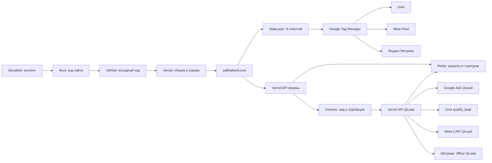

# SID Thailand: архитектура и регламент эксплуатации

Последнее обновление: 2026-07-22

Этот документ является единой инструкцией по сайту `sidthailand.com`, аналитике,
передаче лидов и выпуску изменений. Секретные значения здесь не хранятся.

## 1. Схема простыми словами



- **Storyblok** хранит тексты, изображения и структуру контентных блоков.
- **GitHub** хранит единственную рабочую версию программного кода и историю
  изменений.
- **Vercel** автоматически собирает код из `master`, публикует сайт и выполняет
  два серверных API: приём формы и отправку квалифицированного лида.
- **Домен** направляет посетителя на production-развёртывание Vercel.
- **GTM** получает шесть событий из `dataLayer` и пересылает каждое отдельными
  тегами в GA4, Meta и Яндекс.Метрику.
- **Kommo** является системой учёта лидов и источником статуса квалификации.
- **Redis** атомарно блокирует повторную обработку одной формы или одного QLead.

## 2. Идентификаторы

| Сервис | Объект | Идентификатор |
| --- | --- | --- |
| GTM | SID Thailand - Web | `GTM-MHK8J5FT` |
| GA4 | SID Thailand | `G-F4VRTJKMFH` |
| Google Ads | SID \| Google ADS | `318-045-1827` |
| Google Ads | QLead conversion | `7693506448` |
| Meta | Pixel / dataset | `27845610791699424` |
| Meta | QLead Custom Conversion | `1360859062858336` |
| Яндекс.Метрика | Счётчик | `110873210` |
| Яндекс.Метрика | QLead goal | `586798746` |
| Kommo | Аккаунт | `29042692` |
| Kommo | Workflow (Consultancy) | pipeline `9000268` |
| Kommo | Workflow (Development) | pipeline `9007500` |
| GitHub | Репозиторий | `SID-Thailand/sid` |
| Vercel | Проект | `prj_lPJXVlYDcZJSVff3ZGmkV6iZUm9e` |
| Vercel | Team | `team_AvHJCMH8ggitjA7iSjGV6GZt` |

## 3. События сайта

Сайт создаёт ровно одно событие `dataLayer` на действие. GTM только маршрутизирует
его в три системы. В GTM используются отдельный trigger и отдельный tag для
каждого события и каждой платформы.

| Действие | dataLayer / GA4 | Meta | Цель Метрики |
| --- | --- | --- | --- |
| Просмотр страницы | `page_view` | `PageView` | `586747594` |
| Первое взаимодействие с формой | `form_start` | `form_start` | `586747659` |
| Kommo успешно приняла форму | `generate_lead` | `Lead` | `586747821` |
| Клик WhatsApp | `click_whatsapp` | `click_whatsapp` | `586747856` |
| Клик по телефону | `click_phone` | `click_phone` | `586747857` |
| Клик по email | `click_email` | `click_email` | `586747987` |

Правила:

1. `form_start` срабатывает один раз на просмотр страницы, при первом фокусе в
   любом поле формы.
2. `generate_lead` отправляется только после ответа API `{ ok: true }`, то есть
   после реального создания лида в Kommo.
3. Кликовые события создаёт сайт по фактическому событию `click`, а не GTM Link
   Click. Это исключает два независимых источника одного события.
4. При переходе внутри Nuxt SPA сайт создаёт новый `page_view` и сбрасывает
   однократный флаг `form_start`.

## 4. Обычный лид

1. Посетитель заполняет форму.
2. Браузер сразу блокирует повторный клик по кнопке.
3. `/api/kommo-lead` проверяет JSON, размер, источник запроса, honeypot,
   idempotency key и частоту запросов с одного адреса.
4. Redis атомарно закрепляет request ID. Повтор того же запроса возвращает ID
   уже созданного лида и не создаёт второй лид.
5. API создаёт или находит контакт, создаёт лид в `Qualification / INCOMING`,
   назначает Irina Egorova и добавляет заметку с данными формы.
6. В лид записываются UTM и рекламные идентификаторы. Если UTM не было, пять
   UTM-полей остаются пустыми. API использует только уже существующие поля
   Kommo: если поле отсутствует, значение пропускается и факт фиксируется в
   Vercel Runtime Logs. Новые поля автоматически не создаются.
7. Только после успеха браузер создаёт `generate_lead`.

Передаваемые поля: `utm_source`, `utm_medium`, `utm_campaign`, `utm_content`,
`utm_term`, `gclid`, `gclientid`, `wbraid`, `gbraid`, `fbclid`, `fbp`, `fbc`,
`yclid`, `ymclientid`, `referrer`, `utm_referrer`, `first_landing_page`.

## 5. Квалифицированный лид

QLead не является браузерным событием и не проходит через GTM.

1. Сотрудник сначала проверяет обращение.
2. Только квалифицированное обращение переводится на любую стадию в
   `Workflow (Consultancy)` или `Workflow (Development)`.
3. Kommo вызывает `/api/kommo-qualified-lead`.
4. API повторно запрашивает лид и проверяет pipeline, поэтому поддельный webhook
   не может квалифицировать лид из другой воронки.
5. Для пары `Kommo lead ID + платформа` Redis выполняет атомарный `SET NX`.
   Одновременно работать может только один запрос.
6. Google Ads, GA4, Meta CAPI и Яндекс обрабатываются независимо. Ошибка одной
   платформы не отменяет остальные.
7. Состояние каждой доставки хранится в Redis по ключу
   `qlead-journal:<lead ID>:<platform>` и дублируется безопасной записью в
   Vercel Runtime Logs. QLead не создаёт, не перемещает и не редактирует поля
   Kommo.

Названия:

- GA4: `qualify_lead`.
- Google Ads: conversion action `QLead`.
- Meta CAPI: standard event `Lead`, параметр `lead_type=qualified`, затем Custom
  Conversion `QLead`.
- Яндекс: offline conversion в цель `586798746`.

Для offline conversion Метрики сервер отправляет ровно один идентификатор:
`Yclid`, если он есть, иначе `ClientId` (`ymclientid`). `DateTime` всегда
нормализуется в прошедшее время, как требует API Метрики. ID загрузки и тип
использованного идентификатора сохраняются в Redis-журнале и Vercel Runtime
Logs.

### Зафиксированная схема Kommo

- Состав, тип, название, видимость и расположение полей блока `Main` не меняются
  сервером сайта.
- API сайта может записывать данные только в уже существующие стандартные поля.
- Создание, удаление, переименование или перенос поля выполняется вручную только
  после отдельного письменного согласования владельца CRM.
- Уже существующие служебные поля `qlead_*` не используются новым кодом. Их
  нельзя удалять до отдельной проверки зависимостей и согласования.

## 6. Где лежат настройки и секреты

- Публичные ID находятся в `nuxt.config.ts` и в этом документе. Для Google Ads
  production использует аккаунт `3180451827` и conversion action `7693506448`;
  отдельный login/MCC account не используется.
- Все токены, OAuth secrets и webhook secret находятся только в Vercel:
  `Project -> Settings -> Environment Variables`.
- Redis лучше подключать через Vercel Marketplace / Upstash. Приложение принимает
  стандартные `UPSTASH_REDIS_REST_URL` и `UPSTASH_REDIS_REST_TOKEN`; вручную
  копировать их в другие переменные не требуется.
- Production-секреты доступны только окружению **Production**. Preview не должен
  иметь доступ к production Kommo, рекламным API и Redis.
- Названия обязательных переменных перечислены в `.env.example`; значений там
  быть не должно.
- В GitHub, Storyblok, документах и задачах запрещено сохранять секреты.

После утечки токена:

1. Выпустить новый токен на стороне сервиса.
2. Заменить значение в Vercel Production.
3. Выполнить новый production deploy.
4. Проверить один тестовый запрос.
5. Отозвать старый токен.
6. Зафиксировать дату ротации без значения секрета.

## 7. Доступы

Основной операционный пользователь: `digital@sidthailand.com`.

| Платформа | Необходимый уровень | Где проверять |
| --- | --- | --- |
| Storyblok | Admin пространства SID | Space settings -> Users |
| GitHub | Admin репозитория | Repository -> Settings -> Collaborators |
| Vercel | Team member с правом проекта | Team settings -> Members |
| DNS домена | управление DNS | аккаунт регистратора / DNS-провайдера |
| GTM | Administrator | Admin -> User Management |
| GA4 | Administrator | Admin -> Access Management |
| Google Ads | Admin | Admin -> Access and security |
| Meta Business | Full control dataset и ad account | Business settings -> People |
| Яндекс.Метрика | Edit access | Settings -> Access |
| Kommo | Administrator | Settings -> Users |
| Redis | через Vercel project integration | Vercel -> Integrations / Storage |

Проверка выполняется раз в квартал и после увольнения сотрудника. Личные аккаунты
не должны быть единственными владельцами production-ресурса.

## 8. Выпуск изменений

1. Создать короткую ветку от актуального `master`.
2. Внести одно логически связанное изменение.
3. Локально выполнить `yarn test`, `yarn lint`, `yarn build`.
4. Открыть Pull Request в `master`.
5. Дождаться зелёного GitHub Actions `CI` и обязательного review.
6. Выполнить squash merge. Прямой push в `master` запрещён.
7. Vercel автоматически создаёт Preview для PR и Production после merge.
8. Проверить deployment и критический пользовательский сценарий.
9. Удалить merged-ветку.

## 9. Проверка после релиза

### Формы

1. Открыть сайт с тестовыми UTM.
2. Ввести один символ: `form_start` должен появиться один раз в dataLayer и по
   одному разу в GA4 DebugView, Meta Test Events и отладчике Метрики.
3. Отправить одну валидную форму.
4. Убедиться, что появился один лид, правильный ответственный, UTM и client IDs.
5. На странице без UTM убедиться, что UTM-поля пустые.

### QLead

1. Использовать тестовый лид с рекламным идентификатором и `ymclientid`.
2. Перевести его в одну из двух Workflow-воронок.
3. В Vercel Runtime Logs найти четыре записи `Qualified lead channel state` со
   статусом `sent`: `google`, `ga4`, `meta`, `yandex`.
4. Повторно сохранить стадию и убедиться, что в итоговой записи статусы стали
   `duplicate`, а вторых отправок нет.
5. Проверить диагностику Google Ads, GA4 Realtime, Meta Overview / Custom
   Conversions и историю offline upload Метрики. Серверный QLead не появляется
   в GA4 DebugView и Meta Test Events без специальных debug/test-параметров.
   Обычные отчёты и offline conversion Метрики обновляются асинхронно.
6. В Vercel Runtime Logs найти запись `Qualified lead delivery result` по ID
   лида. В ней должны быть результаты всех четырёх каналов без значений секретов.

### Контрольный production-тест

22 июля 2026 года в 10:29 по Москве проверена тестовая сделка Kommo `15612775`.
После перевода в `Workflow (Consultancy)` сервер получил webhook и записал:

```text
Qualified lead delivery result {
  leadId: 15612775,
  results: { google: 'sent', meta: 'sent', ga4: 'sent', yandex: 'sent' }
}
```

- Google Ads принял transaction ID `kommo-qualified-15612775`.
- GA4 принял `qualify_lead` с event ID `kommo-qualified-15612775`.
- Meta приняла один CAPI event `Lead` с `lead_type=qualified` и тем же event ID.
- Метрика приняла offline conversion: upload ID `1167103149`, идентификатор
  `ClientId`.

`sent` в журнале означает успешный ответ API платформы. Появление события в
интерфейсе платформы может произойти позже. Для Meta диапазон дат обязан
включать день теста; для GA4 QLead сначала ищут в Realtime, а затем в Events;
для Метрики ждут завершения обработки offline upload.

## 10. Диагностика

| Симптом | Что проверить |
| --- | --- |
| Нет обычного лида | Vercel runtime logs для `/api/kommo-lead`, Redis, Kommo token |
| Два лида | одинаков ли idempotency key; доступен ли Redis; нет ли второй формы/интеграции |
| Два события | dataLayer содержит одно событие; trigger GTM только Custom Event; нет auto goal |
| QLead `not_attributable` | наличие client ID / click ID в полях лида |
| QLead `not_configured` | соответствующая Production env variable |
| QLead `retrying` | Redis-журнал и Vercel Runtime Logs |
| Метрика не показывает QLead сразу | проверить upload ID и статус обработки |
| Метрика отклонила offline conversion | проверить `id:Yclid` или `id:ClientId` в Vercel Runtime Logs и что `DateTime` не находится в будущем |

## 11. Ответственность и резервный доступ

- Контент: маркетинг, Storyblok.
- Код и релизы: назначенный разработчик, GitHub PR и Vercel.
- GTM и аналитика: digital team.
- Квалификация: сотрудники Kommo; перемещать в Workflow можно только после
  фактической квалификации.
- Секреты и доступы: владелец digital-инфраструктуры и один резервный
  администратор компании.

Любое изменение ID, воронок, событий, домена или владельцев сначала вносится в
этот документ, затем выпускается через Pull Request.
