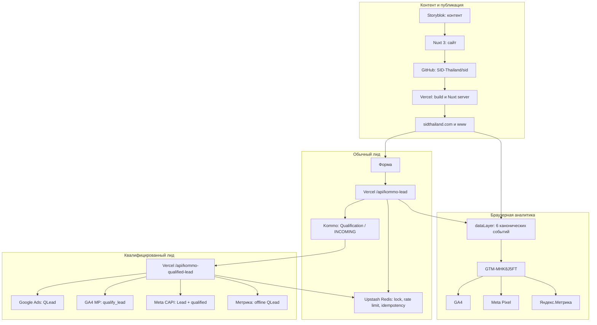

# SID Thailand: полная карта сайта, интеграций и аналитики

Последняя проверка документа: **22 июля 2026 года**

Production-сайт: `https://sidthailand.com`

Основной рабочий адрес компании: `digital@sidthailand.com`

Этот файл является единым источником правды по архитектуре сайта, аналитике,
передаче лидов и доступам. Он предназначен для маркетолога, менеджера CRM,
аналитика и разработчика, который впервые знакомится с проектом.

Секретные значения здесь намеренно не хранятся. В документе можно указывать
имена переменных, публичные ID и пути в интерфейсах, но нельзя публиковать
пароли, API-токены, OAuth client secret, refresh token или webhook secret.

### Быстрая навигация

- [Архитектура](#2-архитектура)
- [Все платформы и ID](#3-реестр-платформ-и-id)
- [Storyblok, GitHub, Vercel и домен](#4-как-связаны-storyblok-github-vercel-и-домен)
- [GTM и браузерная аналитика](#5-браузерная-аналитика-сайт---datalayer---gtm)
- [Таблица шести целей](#6-полная-таблица-шести-целей)
- [Обычный лид в Kommo](#7-обычный-лид-сайт---vercel---kommo)
- [UTM и атрибуция](#8-атрибуция-откуда-пришёл-лид)
- [QLead](#9-qlead-квалифицированное-обращение)
- [Карта кода](#11-карта-кода-где-искать-каждую-интеграцию)
- [Переменные Vercel](#12-переменные-и-секреты-vercel)
- [Доступы digital@sidthailand.com](#13-доступы-и-фактический-статус-digitalsidthailandcom)
- [Инструкции сотруднику](#14-инструкция-новому-сотруднику)
- [Диагностика](#15-диагностика)
- [Известные ограничения](#17-известные-ограничения-и-незакрытые-вопросы)

### Короткий словарь

| Термин | Простое объяснение |
| --- | --- |
| CMS | Система, где редактор меняет контент без изменения кода; здесь это Storyblok |
| Repository | Хранилище исходного кода и его истории; здесь GitHub repository |
| Branch / PR | Временная ветка изменения и запрос на её проверку перед merge |
| Deployment | Конкретная собранная версия сайта в Vercel |
| Production | Версия, которую видят посетители на `sidthailand.com` |
| Preview | Временная версия Vercel для проверки ветки/PR |
| Environment variable | Настройка или секрет, который Vercel передаёт серверному коду |
| `dataLayer` | Очередь событий страницы, которую читает GTM |
| GTM | Маршрутизатор browser events в аналитические платформы |
| Browser event | Событие, созданное в браузере посетителя, например клик |
| Server event | Событие, которое Vercel отправляет напрямую API платформы |
| Webhook | Автоматический HTTP-вызов одного сервиса другим при изменении данных |
| Attribution | Данные, объясняющие, из какой рекламы или источника пришёл лид |
| Idempotency | Гарантия, что повтор одного запроса не создаст второй результат |
| QLead | Проверенное сотрудником квалифицированное обращение |

### На чём основан документ

- production-код и конфигурация сверены с `origin/master`, commit `1c6b41e`;
- предыдущий обязательный CI подтвердил 19 unit tests, lint и production build;
- Vercel API подтвердил team, project, framework и назначенные домены;
- production HTTP-ответ подтвердил Vercel и Nuxt;
- GitHub connector подтвердил текущий профиль `SID-Thailand` и его email;
- GTM, GA4, Google Ads, Meta, Метрика и Kommo ID сверены с кодом и рабочими
  интерфейсами, открывавшимися при настройке;
- QLead подтверждён контрольной сделкой `15612775` и ответами четырёх API.

Факт из интерфейса может измениться после даты проверки. Поэтому роли, env
scopes, campaign goals и live versions проверяются повторно перед изменением
production.

## 1. Самое важное за одну минуту

У проекта есть четыре независимых контура:

1. **Контент и публикация:** Storyblok хранит контент, GitHub хранит код,
   Vercel собирает и публикует Nuxt-сайт, домены ведут на Vercel.
2. **Браузерная аналитика:** сайт создаёт шесть событий в `dataLayer`, один
   контейнер GTM передаёт их в GA4, Meta Pixel и Яндекс.Метрику.
3. **Обычный лид:** форма отправляется в серверный API на Vercel, API защищает
   запрос от повторов и напрямую создаёт контакт и сделку в Kommo.
4. **Квалифицированный лид, или QLead:** после перевода проверенной сделки в
   одну из двух Workflow-воронок Kommo вызывает серверный API. Сервер независимо
   отправляет конверсию в Google Ads, GA4, Meta CAPI и Яндекс.Метрику.

Ключевое различие:

- шесть событий сайта являются **браузерными** и проходят через GTM;
- `QLead` является **серверным** событием и через GTM не проходит;
- `generate_lead` означает «форма создала лид в Kommo»;
- `QLead` означает «сотрудник проверил лид и признал его квалифицированным».

## 2. Архитектура



### Кто за что отвечает

| Слой | Система | Что в ней является источником правды |
| --- | --- | --- |
| Контент | Storyblok | Тексты, изображения и состав контентных блоков |
| Код | GitHub | Компоненты Nuxt, API, тесты, документация и история изменений |
| Хостинг | Vercel | Production deployment, серверные функции, env-переменные и runtime logs |
| Адрес сайта | DNS / домен | Привязка `sidthailand.com` и `www.sidthailand.com` к Vercel |
| Браузерные события | Код сайта | Момент создания события и его параметры в `dataLayer` |
| Маршрутизация событий | GTM | Как событие уходит в GA4, Meta и Метрику |
| Лиды | Kommo | Контакт, сделка, стадия, ответственный и сохранённая атрибуция |
| Защита от повторов | Upstash Redis | Атомарные блокировки обычной формы и QLead |
| Рекламная оптимизация | Google Ads / Meta / Яндекс | Конверсии `QLead` после квалификации сотрудником |

### Контракты между сервисами

Эта таблица отвечает на четыре практических вопроса: кто вызывает кого, чем
авторизуется, какие данные уходят и где искать ошибку.

| Откуда -> куда | Способ связи | Авторизация | Какие данные передаются | Где искать ошибку |
| --- | --- | --- | --- | --- |
| Nuxt -> Storyblok | HTTPS Content Delivery API | `STORYBLOK_TOKEN` | Published/draft content, asset URLs, relations, language | Vercel Logs и Storyblok Publish status |
| GitHub -> Vercel | Vercel Git integration | Доступ Vercel App к репозиторию | Commit, branch, build context | GitHub checks и Vercel build logs |
| Browser -> GTM | Публичный GTM snippet | Не требуется | Только analytics events и неперсональные параметры | Browser dataLayer и Tag Assistant |
| GTM -> GA4 | Google tag | Measurement ID | Шесть browser events | GTM Preview и GA4 Realtime |
| GTM -> Meta | Meta Pixel JavaScript | Pixel ID | Шесть browser events; без формы с PII | GTM Preview и Meta Test Events |
| GTM -> Метрика | Метрика JavaScript API | Counter ID | Page view и шесть целей; без формы с PII | GTM Preview и отладчик Метрики |
| Browser -> Vercel lead API | Same-origin HTTPS POST | Origin, honeypot, request ID; пользовательского логина нет | Форма, page context и attribution | Vercel runtime logs |
| Vercel lead API -> Kommo | Kommo REST API | Long-lived token | Контакт, lead, note и существующие tracking fields | Vercel Logs и карточка Kommo |
| Vercel APIs -> Redis | Upstash REST | Redis URL и token | Locks, counters, delivery journal; не содержимое формы | Vercel Logs и Upstash console |
| Kommo -> Vercel QLead API | Webhook HTTPS POST | Webhook secret | Kommo lead ID и время изменения | Kommo webhook history и Vercel Logs |
| Vercel -> Google Ads | Google Data Manager API | OAuth client + refresh token | Click IDs или хэши email/phone, conversion time, transaction ID | Vercel Logs и Google Ads Diagnostics |
| Vercel -> GA4 | Measurement Protocol | Measurement ID + API secret | `client_id`, `qualify_lead`, lead/event IDs | Vercel Logs, GA4 Realtime/Events |
| Vercel -> Meta | Conversions API | Dataset ID + CAPI token | `Lead`, qualified flag, event ID, hashes and Meta IDs | Vercel Logs и Events Manager |
| Vercel -> Метрика | Offline Conversions API | Counter ID + OAuth token | Goal ID, conversion time и один Yandex identifier | Vercel Logs и upload history |

Raw имя, телефон и email хранятся в Kommo. В браузерную аналитику они не
передаются. Сервер отправляет Google и Meta только нормализованные SHA-256 хэши
контактных данных, когда это нужно для сопоставления QLead.

## 3. Реестр платформ и ID

Публичный ID можно использовать для поиска объекта в интерфейсе. Он не является
паролем. Значение со статусом «не зафиксировано» нельзя угадывать: его нужно
найти в настройках платформы и добавить в этот документ отдельным PR.

| Платформа | Объект | Публичный ID / адрес | Статус |
| --- | --- | --- | --- |
| Сайт | Production | `https://sidthailand.com` | Работает через Vercel |
| Сайт | Production www | `https://www.sidthailand.com` | Назначен проекту Vercel |
| Storyblok | Space SID Thailand | Space ID не зафиксирован | Контент используется сайтом |
| GitHub | Репозиторий | `SID-Thailand/sid` | Основная ветка `master` |
| GitHub | Подключённый профиль | user ID `210815275`, `SID-Thailand` | Email профиля `anton@sidthailand.com` |
| GitHub | Ruleset master | `19537553` | PR + обязательный check `verify` |
| Vercel | Team SID Thailand | `team_AvHJCMH8ggitjA7iSjGV6GZt` | Подтверждено API Vercel |
| Vercel | Проект `sid` | `prj_lPJXVlYDcZJSVff3ZGmkV6iZUm9e` | Framework Nuxt, Node 22.x |
| GTM | Аккаунт SID Thailand | `6366597947` | По URL аккаунта GTM |
| GTM | Контейнер SID Thailand - Web | `GTM-MHK8J5FT` | Единственный контейнер в коде сайта |
| GTM | Внутренний container ID | `258741282` | По URL контейнера GTM |
| GA4 | Аккаунт SID Thailand | `400856860` | По URL GA4 |
| GA4 | Property SID Thailand | `545194857` | По URL GA4 |
| GA4 | Web stream / Measurement ID | `G-F4VRTJKMFH` | Используется GTM и сервером |
| Google Ads | Рекламный аккаунт | `318-045-1827` | Operating account `3180451827` |
| Google Ads | Conversion action QLead | `7693506448` | Серверная offline-конверсия |
| Google Cloud | OAuth project / client | Project ID не зафиксирован | Нужен Google Data Manager API |
| Meta | Business | `1805800593109591` | По URL Events Manager |
| Meta | Pixel / dataset SID Thailand | `27845610791699424` | Browser Pixel и Meta CAPI |
| Meta | Custom Conversion QLead | `1360859062858336` | Фильтр квалифицированного `Lead` |
| Яндекс.Метрика | Счётчик | `110873210` | Browser goals и offline QLead |
| Яндекс.Метрика | QLead goal | `586798746` | Offline conversion |
| Kommo | Аккаунт | `29042692` | `sidthailand.kommo.com` |
| Kommo | Website integration | `SID Thailand Website Leads` | Long-lived token; ID не зафиксирован |
| Formspree | Legacy account/integration | ID и owner не зафиксированы | Не используется текущим Nuxt form flow |
| Kommo | Workflow (Consultancy) | pipeline `9000268` | Все стадии считаются QLead |
| Kommo | Workflow (Development) | pipeline `9007500` | Все стадии считаются QLead |
| Upstash Redis | База проекта | Resource ID не зафиксирован | Подключена через Vercel env |
| DNS / registrar | Домен `sidthailand.com` | Регистратор и account ID не зафиксированы | Требуется инвентаризация владельца |

Проверка сайта 22 июля 2026 года вернула `HTTP 200`, заголовки `server: Vercel`
и `x-powered-by: Nuxt`. Vercel API также подтверждает, что оба production-домена
назначены проекту `sid`.

## 4. Как связаны Storyblok, GitHub, Vercel и домен

### 4.1. Storyblok

Storyblok является CMS, а не хостингом и не местом хранения кода.

- Редактор меняет контент в пространстве SID Thailand.
- Nuxt получает опубликованный контент через Storyblok Content Delivery API.
- Подключение находится в `nuxt.config.ts` через модуль `@storyblok/nuxt`.
- Секрет доступа называется `STORYBLOK_TOKEN` и хранится в Vercel.
- В production сайт запрашивает `published`; в редакторе или development может
  запрашивать `draft`.
- Изображения загружаются через `https://a2.storyblok.com`.
- Изменение текста обычно не требует изменения GitHub-кода. Изменение схемы
  блока, компонента или логики отображения требует разработчика и PR.

Где искать код: `nuxt.config.ts`, `composables/stories/` и компоненты сайта.

### 4.2. GitHub

GitHub хранит исходный код, но сам сайт пользователям не показывает.

- Репозиторий: `SID-Thailand/sid`.
- Production-ветка: `master`.
- Рабочий процесс: отдельная ветка -> Pull Request -> CI -> review -> merge.
- Workflow `.github/workflows/ci.yml` запускает тесты, ESLint и production build.
- Ruleset `19537553` требует Pull Request и check `verify`, запрещает force-push
  и ограничивает удаление защищённой ветки.
- После merge Vercel автоматически начинает production deployment.

Старые рабочие ветки сохранены по решению владельца. Они не влияют на production,
пока не объединены с `master`, но затрудняют навигацию. Не использовать старую
ветку как источник актуального кода.

### 4.3. Vercel

Vercel выполняет сразу три роли:

1. собирает Nuxt-приложение из GitHub;
2. отдаёт страницы сайта через CDN;
3. выполняет серверные API формы и QLead.

Основные объекты:

- team `SID Thailand`;
- project `sid`;
- project ID `prj_lPJXVlYDcZJSVff3ZGmkV6iZUm9e`;
- framework `nuxtjs`, Node `22.x`;
- домены `sidthailand.com` и `www.sidthailand.com`.

Где искать:

- deployment: `Project -> Deployments`;
- ошибки API: `Project -> Logs`;
- переменные: `Project -> Settings -> Environment Variables`;
- домены: `Project -> Settings -> Domains`;
- Redis: `Project -> Storage / Integrations` и env-переменные.

Preview deployment не должен создавать реальные лиды или отправлять рекламные
конверсии с production-секретами. Целевое правило: токены Kommo, рекламных API и
Redis доступны только окружению `Production`. Фактический scope каждой
переменной нужно проверять в Vercel после любого изменения доступа.

### 4.4. Домен и DNS

DNS направляет два домена на Vercel. Сам домен не хранит сайт и не выполняет
интеграции. Если DNS удалить или направить в другое место, GitHub, Storyblok и
Vercel продолжат существовать, но посетители не попадут на production-сайт.

Регистратор домена, DNS-провайдер и корпоративный владелец аккаунта пока не
зафиксированы. Это важный пробел: новый ответственный должен записать название
регистратора, логин владельца, резервного администратора и дату продления. Пароль
в этот документ добавлять нельзя.

## 5. Браузерная аналитика: сайт -> dataLayer -> GTM

### 5.1. Единый dataLayer

Момент события определяет код сайта, а не три аналитические платформы отдельно.
Это предотвращает расхождение логики и повторные срабатывания.

Канонический список находится в `utils/analyticsEvents.ts`. Отправка находится в
`composables/dataLayerEvents.ts`.

Каждое событие содержит общие параметры:

- `event`;
- `page_path`;
- `page_location`;
- `page_language`.

Дополнительные параметры:

| Событие | Дополнительные данные |
| --- | --- |
| `page_view` | `page_title` |
| `form_start` | `form_id`, `form_type` |
| `generate_lead` | `form_type`, `form_context`, атрибуция без имени, телефона и email |
| `click_whatsapp` | `click_url`, `click_text` |
| `click_phone` | `click_url`, `click_text` |
| `click_email` | `click_url`, `click_text` |

Имя, телефон и email не помещаются в `dataLayer` и не отправляются браузерными
тегами. Они уходят только в защищённый серверный API и далее в Kommo.

### 5.2. GTM

На сайте загружается только контейнер `GTM-MHK8J5FT`. Старый контейнер не
присутствует в production-коде; объект в GTM Trash Can не выполняется на сайте.

Принята единая схема имён:

- trigger: точное имя события, например `form_start`;
- GA4 tag: `GA4 - form_start`;
- Meta tag: `Meta - form_start`;
- Yandex tag: `Yandex Metrika - form_start`.

Итого для шести событий:

- 6 Custom Event triggers;
- 6 GA4 tags;
- 6 Meta tags;
- 6 Yandex tags.

`GA4 - page_view` является базовым Google tag для measurement ID
`G-F4VRTJKMFH`. `Meta - page_view` загружает Pixel и отправляет `PageView`.
`Yandex Metrika - page_view` загружает счётчик и фиксирует просмотр. Остальные
теги соответствующей платформы используют уже загруженную базовую библиотеку.

GA4 и Google Ads — разные системы. Шесть browser events GTM отправляет в GA4,
а не отдельными Google Ads conversion tags. Если browser event нужен в Google
Ads, его сначала осознанно помечают Key event в GA4 и импортируют в Ads. QLead,
напротив, отправляется в Google Ads напрямую сервером и от импорта GA4 не
зависит.

Нельзя создавать второй источник тех же событий через GTM Form Interaction,
Link Click, Meta automatic event setup или отдельный скрипт в Storyblok. Для
канонических целей источником служит только Custom Event из `dataLayer`.

## 6. Полная таблица шести целей

Под «целью» ниже понимается одно бизнес-действие, хотя платформы называют его
по-разному: GA4 и Meta используют events, Метрика использует goals.

| Бизнес-событие | Когда срабатывает и откуда берётся | dataLayer / GA4 | Meta | Яндекс goal ID |
| --- | --- | --- | --- | --- |
| Просмотр страницы | После загрузки первой страницы и после уникального Nuxt SPA-перехода; `usePageViewTracking()` | `page_view` | standard `PageView` | `page_view`, `586747594` |
| Начало формы | Первый `focusin` внутри любой формы; глобальная защита даёт одно событие на page view | `form_start` | custom `form_start` | `form_start`, `586747659` |
| Создан лид | Только после ответа `/api/kommo-lead` с `{ok:true}` и реального создания/возврата Kommo lead ID | `generate_lead` | standard `Lead` | `generate_lead`, `586747821` |
| Клик WhatsApp | Реальный клик по `wa.me`, `whatsapp.com` или `whatsapp:`; общий click listener сайта | `click_whatsapp` | custom `click_whatsapp` | `click_whatsapp`, `586747856` |
| Клик по телефону | Реальный клик по ссылке `tel:` | `click_phone` | custom `click_phone` | `click_phone`, `586747857` |
| Клик по email | Реальный клик по ссылке `mailto:` | `click_email` | custom `click_email` | `click_email`, `586747987` |

### Роль события в отчётности

| Событие | Бизнес-смысл | Рекомендуемая роль |
| --- | --- | --- |
| `page_view` | Посетитель увидел страницу | Диагностическое событие, не основная конверсия |
| `form_start` | Посетитель начал вводить данные | Микроконверсия для анализа формы |
| `generate_lead` | В Kommo появился обычный лид | Основная browser-конверсия по заявкам |
| `click_whatsapp` | Намерение связаться через WhatsApp | Микроконверсия / контактное действие |
| `click_phone` | Намерение позвонить | Микроконверсия / контактное действие |
| `click_email` | Намерение написать email | Микроконверсия / контактное действие |
| `QLead` / `qualify_lead` | Сотрудник подтвердил качество лида | Основная conversion для оптимизации рекламы на качество |

Наличие события в GA4 не означает, что оно автоматически является Key event.
Наличие Meta event не означает, что он автоматически выбран целью ad set.
Наличие цели Метрики не означает, что она автоматически используется кампанией
Директа. Оптимизационная роль задаётся отдельно в рекламной платформе.

### Правила, которые нельзя менять без согласования

1. `form_start` срабатывает один раз на page view, а не на каждую букву и не на
   каждое поле. Флаг `window.__sidFormStartTracked` сбрасывается новым
   `page_view`.
2. `generate_lead` не является кликом по Submit. Неуспешная форма, honeypot или
   ошибка Kommo не должны создавать это событие.
3. Контактные клики создаёт код сайта. GTM Link Click для этих трёх событий не
   используется.
4. Один dataLayer event должен запускать ровно один tag каждой платформы.
5. В Meta названия стандартных событий регистрозависимы: `PageView` и `Lead`.
6. Автоматические цели Метрики могут оставаться в аккаунте, но не являются
   каноническими шестью целями. Не использовать автоцель «отправка формы» вместо
   `generate_lead`, иначе отчёты могут считать одно действие двумя способами.

### Где увидеть событие

| Платформа | Быстрая проверка | Обычный отчёт |
| --- | --- | --- |
| GTM | Preview / Tag Assistant: один dataLayer event и один fired tag платформы | Versions показывает опубликованную конфигурацию |
| GA4 | Admin -> DebugView или Reports -> Realtime | Reports -> Engagement -> Events |
| Meta | Events Manager -> Dataset -> Test Events | Events Manager -> Overview |
| Яндекс | Счётчик -> Отладчик целей / визит в реальном времени | Метрика -> Конверсии |

GA4 и рекламные интерфейсы обрабатывают данные асинхронно. Отсутствие события в
обычном отчёте сразу после теста не доказывает ошибку. Сначала проверяется GTM
Preview, затем realtime/test-интерфейс, затем обычный отчёт.

## 7. Обычный лид: сайт -> Vercel -> Kommo

### 7.1. Последовательность

1. Посетитель заполняет имя, телефон и email.
2. Браузер проверяет обязательные поля и блокирует повторный Submit.
3. `composables/formSend.ts` собирает форму и текущую атрибуцию.
4. Браузер вызывает `POST /api/kommo-lead` с `Idempotency-Key`.
5. API проверяет JSON, размер тела, разрешённый origin, honeypot, request ID и
   rate limit по IP.
6. Upstash Redis атомарно блокирует повтор того же request ID.
7. API находит контакт по телефону или создаёт новый контакт.
8. API создаёт сделку в `Qualification`, стадия `INCOMING`, ответственный
   **Irina Egorova**.
9. API пишет заметку с формой, страницей, языком и непустыми tracking-полями.
10. После успеха браузер создаёт `generate_lead` в `dataLayer`.

Endpoint и логика: `server/api/kommo-lead.post.ts`.

### 7.2. Что сохраняется в Kommo

- имя лида: `<тип формы>: <имя или телефон>`;
- контакт: имя, телефон, email;
- form type и form context;
- URL и язык страницы;
- UTM, click IDs, analytics client IDs, first landing page и referrer;
- общая заметка `Website form submission`.

Если пяти UTM в URL не было, их поля должны быть пустыми. Шаблонные значения
`qa`, `direct_integration` и другие подстановки не используются.

API получает карту существующих полей Kommo и не создаёт новые поля. Если
ожидаемого tracking-поля нет, значение пропускается и в Vercel Logs появляется
предупреждение. Состав, тип, название, видимость и расположение полей блока
`Main` менять запрещено без отдельного письменного разрешения владельца CRM.

### 7.3. Защита формы

| Защита | Зачем нужна |
| --- | --- |
| Client submit lock | Не даёт пользователю дважды быстро нажать Submit |
| Honeypot `website` | Отсеивает простых ботов |
| Origin check | Не принимает форму с постороннего сайта |
| JSON и body-size validation | Не принимает неожиданный или слишком большой запрос |
| Rate limit по IP | Ограничивает массовую отправку |
| Idempotency-Key | Повтор одного запроса возвращает существующий lead ID |
| Redis `SET NX` | Делает дедупликацию атомарной даже при параллельных запросах |

Идемпотентность обычной формы хранится 24 часа. Если Redis недоступен, API не
должен молча создавать неограниченные дубли: ошибку нужно искать в Vercel Logs.

## 8. Атрибуция: откуда пришёл лид

Атрибуция сохраняется в `sessionStorage` под ключом `sid_traffic_source` только
на время текущей вкладки/сессии. Поэтому рекламная метка не переносится в
следующий независимый прямой визит.

| Поле | Откуда берётся | Для чего используется |
| --- | --- | --- |
| `utm_source` | URL | Источник, например google или facebook |
| `utm_medium` | URL | Тип трафика, например cpc |
| `utm_campaign` | URL | Кампания |
| `utm_content` | URL | Объявление / креатив |
| `utm_term` | URL | Ключевое слово / сегмент |
| `gclid` | URL Google Ads | Offline attribution Google Ads |
| `wbraid` | URL Google Ads | Attribution web-to-app / privacy scenarios |
| `gbraid` | URL Google Ads | Attribution app-to-web / privacy scenarios |
| `gclientid` | cookie `_ga` | Связывает серверный `qualify_lead` с клиентом GA4 |
| `fbclid` | URL Meta | Идентификатор рекламного клика Meta |
| `fbp` | cookie `_fbp` | Browser ID Meta |
| `fbc` | cookie `_fbc` или создаётся из `fbclid` | Click ID для Meta CAPI |
| `yclid` | URL Яндекс.Директа | Приоритетный ID offline conversion Метрики |
| `ymclientid` | `ym(...getClientID)` или `_ym_uid` | Резервный ClientId для Метрики |
| `first_landing_page` | Первый URL текущей сессии | Первая страница визита |
| `first_referrer` | `document.referrer` | Сайт, с которого пришёл посетитель |

Имя, email и телефон берутся из контакта Kommo только на сервере. Для Google и
Meta они нормализуются и SHA-256 хэшируются перед отправкой. В Vercel Logs и
Redis нельзя сохранять исходные секреты и лишние персональные данные.

## 9. QLead: квалифицированное обращение

### 9.1. Бизнес-правило

QLead создаётся, когда сотрудник после проверки переводит сделку на любую
стадию одной из двух воронок:

- `Workflow (Consultancy)`, pipeline `9000268`;
- `Workflow (Development)`, pipeline `9007500`.

Все стадии этих двух воронок считаются квалифицированными, потому что
неквалифицированные обращения сотрудники туда не переводят. Воронка
`Qualification` сама по себе QLead не создаёт.

### 9.2. Техническая последовательность

1. Kommo отправляет webhook изменения сделки на
   `/api/kommo-qualified-lead?key=<secret>`.
2. API повторно запрашивает сделку у Kommo и проверяет фактический pipeline.
3. Для каждой пары `<Kommo lead ID + platform>` Redis создаёт отдельный lock.
4. Google Ads, GA4, Meta и Яндекс отправляются независимо друг от друга.
5. Успешная доставка получает статус `sent`; это значение не переименовывается.
6. Результат хранится один год в Redis и пишется в Vercel Runtime Logs.
7. Повторный webhook получает `duplicate` и не создаёт вторую конверсию.

Endpoint: `server/api/kommo-qualified-lead.post.ts`.

Redis-ключи: `qlead:<leadId>:<channel>` и
`qlead-journal:<leadId>:<channel>`.

Новый QLead-код не использует поля `qlead_*` в Kommo и не изменяет карточку
сделки. Существующие поля нельзя удалять без отдельной проверки других
интеграций и разрешения владельца CRM.

### 9.3. Таблица QLead по платформам

| Платформа | Что получает | Публичный ID | Какая атрибуция нужна | Где проверять |
| --- | --- | --- | --- | --- |
| Google Ads | Offline conversion `QLead`, transaction ID `kommo-qualified-<leadId>` | Conversion action `7693506448`; account `3180451827` | `gclid`, `gbraid` или `wbraid`; при отсутствии используется хэш email/phone | Goals -> Conversions -> QLead -> Diagnostics |
| GA4 | Measurement Protocol event `qualify_lead` | `G-F4VRTJKMFH` | Обязателен `gclientid` | Realtime, затем Events; не ждать его в DebugView без debug-параметра |
| Meta | CAPI standard event `Lead`, `lead_type=qualified`, event ID `kommo-qualified-<leadId>` | Dataset `27845610791699424`; Custom Conversion `1360859062858336` | Хэш email/phone, желательно `fbp`/`fbc` | Events Manager Overview и Custom Conversions |
| Яндекс | Offline conversion в цель `qualify_lead` | Counter `110873210`; goal `586798746` | Один ID: сначала `yclid`, иначе `ymclientid` | История offline uploads, затем отчёт Конверсии |

В Meta обычный `generate_lead` и QLead оба используют стандартный event `Lead`,
но это разные этапы воронки. QLead отличается параметром
`lead_type=qualified`; Custom Conversion `QLead` должна фильтровать именно этот
параметр. Поэтому эти события нельзя считать дублями друг друга.

В Google Ads conversion action можно использовать во всех кампаниях или только
в выбранных кампаниях. Это определяется настройкой Goals каждой кампании, а не
кодом сайта. Перед включением Smart Bidding проверить, что QLead назначен
Primary только там, где оптимизация действительно должна идти на
квалифицированные обращения.

### 9.4. Подтверждённый production-тест

22 июля 2026 года в 10:29 по Москве проверена сделка Kommo `15612775`,
`Test QA QLead Codex 220726`. После перевода в `Workflow (Consultancy)` Vercel
зафиксировал:

```text
Qualified lead delivery result {
  leadId: 15612775,
  results: { google: 'sent', meta: 'sent', ga4: 'sent', yandex: 'sent' }
}
```

- Google Ads принял transaction ID `kommo-qualified-15612775`.
- GA4 endpoint принял `qualify_lead`.
- Meta приняла ровно один CAPI event с тем же event ID.
- Метрика приняла offline upload `1167103149` через `ClientId`.

`sent` означает успешный ответ API платформы. Это не обещает мгновенное
появление строки в интерфейсе: обычные отчёты, Custom Conversion и offline upload
могут обновляться позже.

## 10. Kommo: структура и интеграции

### 10.1. Основная интеграция сайта

- имя: `SID Thailand Website Leads`;
- авторизация: long-lived Kommo token;
- токен хранится только в Vercel Production;
- обычные лиды создаются в `Qualification / INCOMING`;
- ответственный: Irina Egorova;
- webhook QLead защищён отдельным secret;
- API читает существующие tracking-поля и не создаёт поля автоматически.

### 10.2. Наследие, которое намеренно сохранено

В Kommo могут оставаться старые интеграции:

- `Formspree to Kommo Bridge`;
- `SID Forms`;
- `Integration name`.

Текущий Nuxt-код не отправляет новые формы в Formspree: активный production-flow
идёт напрямую в `/api/kommo-lead`. Старые интеграции сохранены по решению
владельца и не должны удаляться без отдельной проверки webhook, automation и
внешних форм. Их наличие в списке интеграций не означает, что сайт ими
пользуется.

## 11. Карта кода: где искать каждую интеграцию

| Файл / каталог | Ответственность |
| --- | --- |
| `nuxt.config.ts` | GTM ID, Storyblok module, публичные defaults и server runtime config |
| `.env.example` | Полный список ожидаемых env-переменных без значений |
| `app.vue` | Подключение глобального page view и contact-click tracking |
| `utils/analyticsEvents.ts` | Разрешённые шесть browser events и классификация contact links |
| `composables/dataLayerEvents.ts` | Единый push в dataLayer, page views и дедупликация form start |
| `composables/contactClickTracking.ts` | Один document-level listener для WhatsApp, phone и email |
| `components/AppForm.vue` | Первый `focusin`, honeypot и client validation формы |
| `composables/formSend.ts` | Сбор формы, attribution, Idempotency-Key и `generate_lead` после успеха |
| `utils/trafficSource.ts` | UTM/click/client IDs и sessionStorage attribution |
| `utils/formProtection.ts` | Client request ID и honeypot helpers |
| `server/api/kommo-lead.post.ts` | Защищённое создание contact/lead/note в Kommo |
| `server/api/kommo-qualified-lead.post.ts` | Проверка QLead и отправка четырём платформам |
| `server/utils/kommo.ts` | Kommo config, API client и карта существующих tracking fields |
| `server/utils/atomicStore.ts` | Атомарные Redis-команды, locks и rate limit |
| `server/utils/qleadDedupe.ts` | QLead keys, journal format и TTL |
| `server/utils/providerUserData.ts` | Нормализация email/phone перед hashing |
| `server/utils/yandexOfflineConversion.ts` | Формирование корректного offline conversion CSV |
| `.github/workflows/ci.yml` | Тесты, lint и production build для PR/master |
| `tests/` | Unit-тесты analytics, attribution, form protection и QLead logic |
| `docs/operations-runbook.md` | Этот единый документ |

Если поведение платформы не совпадает с документом, сначала сверить production
commit в Vercel с `master`, затем код и GTM Live version. Не исправлять расхождение
созданием второго тега или второго webhook.

## 12. Переменные и секреты Vercel

Полный список имён находится в `.env.example`. Значения читаются через
`runtimeConfig` в `nuxt.config.ts`.

### Контент и Kommo

- `STORYBLOK_TOKEN`
- `NUXT_KOMMO_SUBDOMAIN`
- `NUXT_KOMMO_LONG_LIVED_TOKEN`
- `NUXT_KOMMO_PIPELINE_ID`
- `NUXT_KOMMO_STATUS_ID`
- `NUXT_KOMMO_RESPONSIBLE_USER_ID`
- `NUXT_KOMMO_QUALIFIED_WEBHOOK_SECRET`

### Google Ads и GA4

- `NUXT_KOMMO_GOOGLE_DATA_MANAGER_CLIENT_ID`
- `NUXT_KOMMO_GOOGLE_DATA_MANAGER_CLIENT_SECRET`
- `NUXT_KOMMO_GOOGLE_DATA_MANAGER_REFRESH_TOKEN`
- `NUXT_KOMMO_GOOGLE_ADS_OPERATING_ACCOUNT_ID`
- `NUXT_KOMMO_GOOGLE_ADS_LOGIN_ACCOUNT_ID`
- `NUXT_KOMMO_GOOGLE_ADS_CONVERSION_ACTION_ID`
- `NUXT_KOMMO_GA4_MEASUREMENT_ID`
- `NUXT_KOMMO_GA4_MEASUREMENT_PROTOCOL_API_SECRET`

### Meta и Яндекс

- `NUXT_KOMMO_META_PIXEL_ID`
- `NUXT_KOMMO_META_CONVERSIONS_API_TOKEN`
- `NUXT_KOMMO_YANDEX_METRIKA_COUNTER_ID`
- `NUXT_KOMMO_YANDEX_METRIKA_OAUTH_TOKEN`
- `NUXT_KOMMO_YANDEX_METRIKA_QUALIFIED_GOAL_ID`

### Redis

Приложение принимает стандартную пару Upstash:

- `UPSTASH_REDIS_REST_URL`
- `UPSTASH_REDIS_REST_TOKEN`

Также поддерживаются совместимые Vercel KV names. Нельзя одновременно держать
несколько непонятных пар с разными базами без документированного решения.

Публичные ID продублированы в `nuxt.config.ts` как defaults. Секретные значения
в GitHub не хранятся.

## 13. Доступы и фактический статус digital@sidthailand.com

Статусы в таблице означают:

- **Да:** есть прямое подтверждение именно для `digital@sidthailand.com`.
- **Частично:** рабочая сессия или доступ подтверждены, но email/роль не
  подтверждены в разделе управления пользователями.
- **Нет подтверждения:** это не доказательство отсутствия доступа; доступ нужно
  проверить или выдать.
- **Наследуется:** отдельного пользователя нет, право приходит через другую
  платформу.

| Платформа | Нужный уровень | Статус для `digital@sidthailand.com` | Что подтверждено / чего не хватает | Где проверить или выдать |
| --- | --- | --- | --- | --- |
| GTM | Administrator контейнера | **Да** | Версии контейнера опубликованы пользователем `digital@sidthailand.com` | GTM -> Admin -> User Management |
| GA4 | Administrator property | **Да, роль требует сверки** | Property была создана на том же Google-аккаунте по подтверждению владельца; точный role audit не зафиксирован | GA4 -> Admin -> Property access management |
| Google Ads | Admin | **Частично** | Рабочий доступ к аккаунту использовался; exact login и Admin role отдельно не зафиксированы | Google Ads -> Admin -> Access and security |
| Storyblok | Admin пространства | **Частично** | Редакторская сессия и production-контент доступны; membership именно `digital@` не сверено | Storyblok -> Space settings -> Users |
| GitHub | Admin репозитория | **Нет подтверждения** | Подключённый GitHub-профиль: `SID-Thailand`, email `anton@sidthailand.com`; наличие отдельного пользователя `digital@` не доказано | Repository -> Settings -> Collaborators and teams |
| Vercel | Team member с доступом к project | **Нет подтверждения** | Подключённый Vercel OAuth видит team и project, но API не показывает email текущего пользователя; исторически creator указан как `anton@sidthailand.com` | Team -> Settings -> Members |
| DNS / registrar | Владелец или Admin | **Нет подтверждения** | Не зафиксированы регистратор, DNS-провайдер и владелец аккаунта | Кабинет регистратора / DNS-провайдера |
| Meta Business | Full control dataset и ad account | **Частично** | Доступ через текущий Facebook-профиль подтверждён; привязка к email `digital@` и ad account ID не сверены | Business Settings -> Users -> People; Data Sources -> Datasets |
| Яндекс.Метрика | Редактирование счётчика | **Частично** | Счётчик настраивался из рабочей сессии; точный Yandex ID/email не зафиксирован | Counter -> Settings -> Access |
| Kommo | Administrator | **Частично** | Admin-доступ в рабочей сессии подтверждён; login email пользователя не зафиксирован | Settings -> Users |
| Upstash Redis | Управление базой | **Наследуется / не подтверждено** | Приложение использует Vercel integration; доступ `digital@` зависит от membership в Vercel team | Vercel -> Storage / Integrations и Upstash console |
| Google Cloud OAuth | Owner/Editor OAuth project | **Нет подтверждения** | Project ID, owner и список пользователей не внесены в инвентарь | Google Cloud Console -> IAM и APIs & Services -> Credentials |
| Formspree legacy | Admin legacy account | **Нет подтверждения** | Активный сайт сервис не использует, но owner старого account/integration не внесён в инвентарь | Formspree -> Team / Account settings |

### Что означает итог проверки доступов

На 22 июля 2026 года нельзя утверждать, что `digital@sidthailand.com` имеет
независимый административный доступ ко **всем** ресурсам. Точно подтверждён GTM;
GA4 подтверждён владельцем, но роль нужно сверить. Для GitHub, Vercel, DNS и
Google Cloud требуется отдельная инвентаризация. Для Meta, Яндекса, Storyblok и
Kommo доступ работает, но email и уровень роли не подтверждены через User
Management.

Email сам по себе не создаёт доступ:

- в GitHub нужен GitHub user, приглашённый в репозиторий;
- в Meta нужен Facebook user в Business Manager;
- в Яндексе нужен Yandex ID;
- в Vercel нужен member команды;
- в Kommo нужен отдельный пользователь.

Целевое состояние: `digital@sidthailand.com` или соответствующая корпоративная
учётная запись имеет Admin, а у компании есть второй резервный администратор.
Личная учётная запись одного сотрудника не должна быть единственным владельцем.

### Минимальная матрица ответственности

| Область | Основной ответственный | Резервный ответственный | Что он подтверждает |
| --- | --- | --- | --- |
| Контент | Назначенный редактор Storyblok | Руководитель маркетинга | Draft, Publish и корректность страницы |
| Аналитика | Digital team | Второй Google/Meta/Yandex admin | GTM version, события и определения конверсий |
| CRM | Kommo administrator | Руководитель отдела продаж | Воронки, стадии, пользователи и неизменность Main fields |
| Код | Назначенный разработчик | Второй repository maintainer | PR, CI, tests и rollback |
| Hosting/API | Vercel team owner | Второй Vercel owner | Deployment, env scopes, logs и Redis |
| Домен | Корпоративный владелец registrar account | Финансовый/IT owner | DNS, renewal и recovery access |
| Документ | Digital owner | Технический owner | ID, доступы и дата последней проверки |

ФИО конкретных ответственных пока не зафиксированы. Их нужно записать после
назначения, не подменяя корпоративное владение личной учётной записью.

## 14. Инструкция новому сотруднику

### Изменить текст или изображение

1. Открыть Storyblok space SID Thailand.
2. Найти нужную story и изменить контент.
3. Проверить Preview.
4. Нажать Publish.
5. Открыть production-сайт и проверить опубликованную страницу.

Если нужного поля или блока нет, не менять JSON вручную: создать задачу
разработчику, потому что требуется изменение схемы и Nuxt-компонента.

### Выпустить изменение кода

1. Получить актуальный `master`.
2. Создать короткую ветку.
3. Внести одно логически связанное изменение.
4. Запустить `yarn test`, `yarn lint`, `yarn build`.
5. Открыть Pull Request в `master`.
6. Дождаться зелёного GitHub Actions check `verify` и review.
7. Выполнить squash merge.
8. Проверить production deployment в Vercel.
9. Выполнить smoke test формы и затронутых событий.

Прямой push в `master`, force-push и публикация секретов запрещены.

### Проверить обычную форму

1. Открыть новую сессию с тестовыми UTM.
2. В GTM Preview ввести один символ: `form_start` должен появиться один раз,
   каждый из трёх tags должен fired один раз.
3. Отправить валидную форму.
4. Проверить один новый lead в `Qualification / INCOMING` и Irina Egorova.
5. Проверить UTM, click IDs, client IDs и заметку.
6. Повторить тест без UTM: пять UTM-полей должны быть пустыми.
7. Проверить `generate_lead` по одному разу в GTM, GA4, Meta и Метрике.

### Проверить QLead

1. Использовать отдельный тестовый лид, созданный с client/click IDs.
2. Записать Kommo lead ID.
3. Перевести лид в любую стадию одной из двух Workflow-воронок.
4. В Vercel Logs найти `Qualified lead delivery result` по lead ID.
5. Убедиться, что `google`, `meta`, `ga4`, `yandex` имеют `sent`.
6. Проверить платформенные интерфейсы с учётом задержки обработки.
7. Повторно сохранить стадию и убедиться в `duplicate`, а не в новой отправке.

Серверный QLead обычно не виден в GA4 DebugView и Meta Test Events без
специальных debug/test-параметров. Основное оперативное доказательство доставки
сразу после теста: успешный ответ API и статус `sent` в Vercel Logs/Redis.

### Изменить аналитическое событие

1. Сначала изменить бизнес-определение в разделе 6 этого документа.
2. Изменить единый event в коде сайта.
3. Изменить отдельные tags в GTM, не создавая второй источник события.
4. Проверить все три платформы.
5. Опубликовать новую версию GTM с понятным именем.
6. Обновить этот документ в том же PR.

### Изменить поле Kommo

Не делать этого самостоятельно. Сначала получить отдельное письменное
разрешение владельца CRM. В запросе указать название, тип, раздел, цель,
интеграции-потребители и план отката. Блок `Main` сохраняется в утверждённом
виде.

## 15. Диагностика

| Симптом | Что проверить в первую очередь |
| --- | --- |
| Сайт не открывается | Vercel deployment, Domains, затем DNS |
| Контент не обновился | Storyblok Publish, published/draft, затем Vercel/site cache |
| Нет browser event | Сначала `dataLayer`, затем trigger/tag GTM, затем платформа |
| `form_start` два раза | В левой колонке Tag Assistant должно быть одно `form_start`; исключить `gtm.formInteract`, встроенный form listener и второй скрипт |
| Лид не создан | `/api/kommo-lead` в Vercel Logs, Redis, Kommo token, pipeline/status IDs |
| Созданы два лида | Idempotency-Key, Redis availability, наличие второй внешней формы/интеграции |
| UTM заполнены без UTM в URL | Проверить sessionStorage новой сессии и CRM automation/template values |
| QLead `not_configured` | Наличие нужных Production env vars |
| QLead `not_attributable` | Наличие client ID/click ID и контакта в Kommo |
| QLead `retrying` | Ошибка конкретного API в Vercel Logs и Redis journal |
| QLead `duplicate` | Нормальная работа дедупликации; повтор не отправляется |
| Google Ads не показывает QLead сразу | Conversion Diagnostics, transaction ID и окно обработки |
| GA4 не показывает QLead в DebugView | Это server Measurement Protocol без debug mode; смотреть Realtime/Events |
| Meta Custom Conversion показывает 0 | Проверить CAPI acceptance, `lead_type=qualified`, диапазон дат и задержку отчёта |
| Метрика не показывает QLead | Проверить upload ID, статус offline upload и использованный `Yclid`/`ClientId` |

## 16. Безопасность и порядок

1. Не хранить секреты в GitHub, документах, Storyblok, GTM Custom HTML или
   карточке Kommo.
2. Включить 2FA на GitHub, Vercel, Google, Meta, Яндекс, Storyblok и Kommo.
3. Выдавать минимально достаточный доступ и удалять его после увольнения.
4. Раз в квартал сверять User Management всех платформ с таблицей раздела 13.
5. После утечки создать новый секрет, заменить его в Vercel Production,
   redeploy, проверить один запрос и отозвать старый секрет.
6. Ранее Vercel token передавался через рабочий чат. Его значение нельзя
   повторять; пока отзыв старого token не подтверждён, считать его
   скомпрометированным и проверить в Vercel Account Settings -> Tokens.
7. Webhook QLead сейчас использует secret в query string. Это рабочая защита,
   но URL может попадать в журналы. При следующем техническом улучшении перейти
   на проверяемую подпись или секретный header, если Kommo позволит это сделать.

## 17. Известные ограничения и незакрытые вопросы

Это не список ошибок production. Это список фактов, которые новый сотрудник не
должен принимать за проверенные без дополнительной инвентаризации.

1. Не зафиксированы Storyblok Space ID и точный Admin membership.
2. Не зафиксированы регистратор домена, DNS-провайдер, владелец и дата продления.
3. Не зафиксированы Google Cloud project ID и владелец OAuth client для Google
   Data Manager API.
4. Не подтверждён независимый доступ `digital@sidthailand.com` к GitHub и
   Vercel; подключённый GitHub-профиль использует `anton@sidthailand.com`.
5. Не подтверждены точные login/email и роли в Meta, Яндексе, Storyblok и Kommo.
6. Не зафиксирован Meta Ad Account ID и его связь с Custom Conversion QLead.
7. Нужно отдельно сверить, помечен ли `qualify_lead` в GA4 как Key event, если
   он должен использоваться как конверсия в отчётах GA4.
8. Нужно документировать состояние GA4 Enhanced Measurement для SPA page views,
   чтобы автоматическое измерение истории не конкурировало с каноническим
   `page_view` из dataLayer.
9. Автоматические цели Яндекса сохранены по решению владельца и могут визуально
   пересекаться с шестью каноническими целями. Для отчётности использовать ID из
   раздела 6.
10. Старые Kommo integrations сохранены и не считаются активным сайтом, но их
    зависимости не аудированы.
11. Resource ID и отдельный owner Upstash Redis не зафиксированы.
12. Retention Vercel Logs зависит от тарифа; Redis journal является более
    долговременным техническим доказательством QLead, но не заменяет бизнес-
    отчёт платформы.

## 18. Критерии исправной системы

Схема считается исправной, когда одновременно выполняются условия:

- production отдаётся Vercel и получает published-контент Storyblok;
- в коде присутствует только `GTM-MHK8J5FT`;
- каждое из шести действий создаёт один dataLayer event;
- один event запускает один tag GA4, один Meta tag и один Yandex tag;
- валидная форма создаёт одну сделку в Kommo, а форма без UTM оставляет UTM
  пустыми;
- QLead создаётся только в двух Workflow pipelines;
- повторный webhook не создаёт вторую QLead-конверсию;
- Vercel Logs показывают независимый результат четырёх QLead channels;
- ни один секрет не находится в GitHub или этом документе;
- для каждого production-сервиса есть корпоративный и резервный администратор.

## 19. Регламент обновления этого документа

Документ обновляется в том же Pull Request, если меняются:

- домен, Vercel project или GitHub repository;
- Storyblok space или token ownership;
- GTM container, GA4 property, Meta dataset или Yandex counter;
- название, смысл, ID или источник события;
- Kommo pipeline, stage, responsible user или tracking fields;
- QLead conversion action / custom conversion / offline goal;
- env variable, Redis integration или схема дедупликации;
- владелец, администратор или резервный доступ.

Перед merge автор проверяет все публичные ID, пути в интерфейсах, отсутствие
секретов и дату последней проверки. После merge этот файл остаётся единственным
актуальным документом; `analytics-goals.md`, `analytics-measurement-plan.md` и
`site-architecture.md` должны только ссылаться на него.
